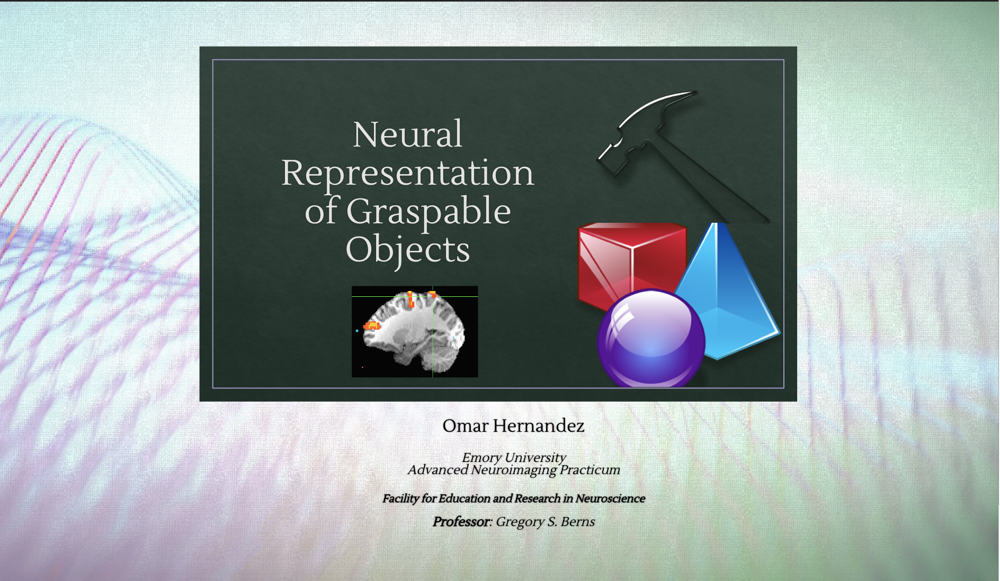
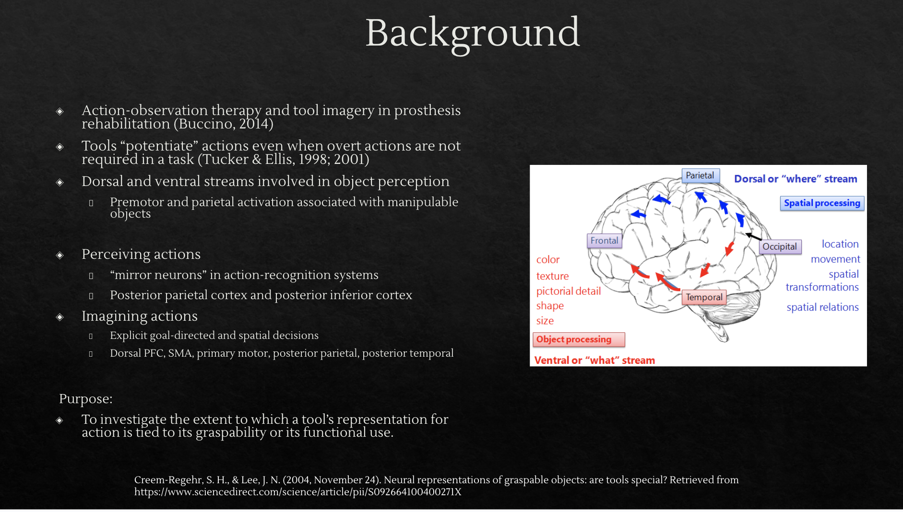
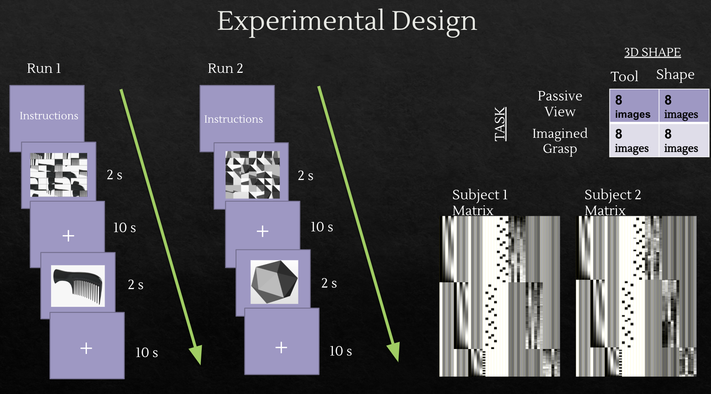
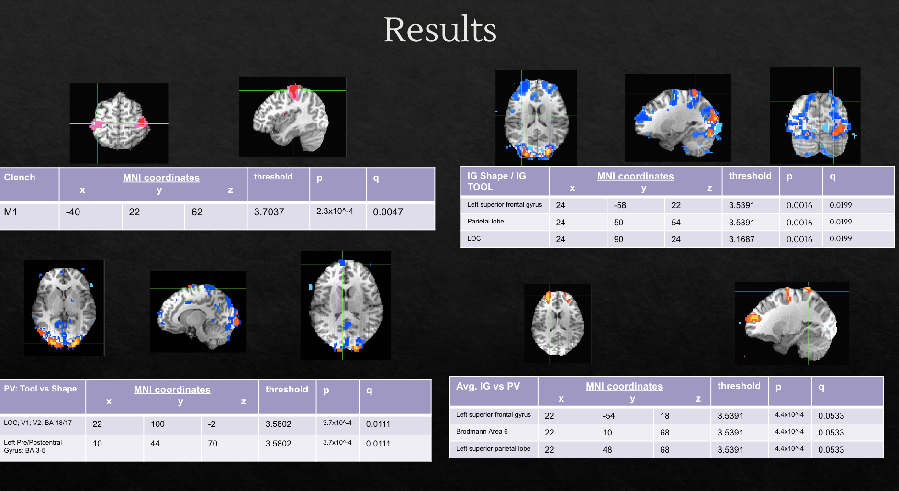

# Neural Representations of Graspable Objects: A Data Engineering Approach to Neuroprosthetic Research

<div align="center">
  
</div>

[](https://python.org)
[](https://afni.nimh.nih.gov)
[](LICENSE)
[](CITATION.cff)

## Table of Contents

- [Project Motivation](#project-motivation)
- [Research Question & Experimental Design](#research-question--experimental-design)
- [Technical Implementation](#technical-implementation)
- [Key Results](#key-results)
- [Figure Legends](#figure-legends)
- [Technical Achievements](#technical-achievements)
- [Getting Started](#getting-started)
- [Project Structure](#project-structure)
- [Impact and Applications](#impact-and-applications)
- [Limitations](#limitations)
- [References](#references)
- [Contributing](#contributing)
- [License](#license)
- [Citation](#citation)
- [Contact](#contact)

## Project Motivation

<div align="center">
  
</div>

This project investigates neural representations of graspable objects using a comprehensive data engineering approach, combining Python analysis pipelines with AFNI neuroimaging workflows. The research addresses a critical question in neuroprosthetic rehabilitation: **How can we leverage our understanding of tool representation to improve motor recovery and brain-computer interface design?**

Traditional prosthesis rehabilitation relies on action observation therapy—using visual cortex training to improve motor control in amputees. Understanding the neural mechanisms underlying tool representation directly informs:
- **Brain-computer interface design** for prosthetic control
- **Rehabilitation protocols** for motor recovery  
- **Motor imagery training** systems for amputees

## Research Question & Experimental Design

**Core Research Question:** Are tools special? Do they automatically activate motor representations based on functional identity rather than just graspability?

This study replicates and extends **Creem-Regehr & Lee (2004)** using modern data engineering practices:

- **Design:** 2×2×2 factorial block design
- **Factors:** Task (Passive Viewing vs Imagined Grasp) × Object Type (Tools vs Shapes) × Graspability
- **Participants:** Representative subject (S01) with complete dataset
- **Total Data Points:** 1,325 trials across all experimental conditions

### Experimental Runs
1. **Run 1 - Passive Viewing (PV)**: Visual attention task (660 trials)
2. **Run 2 - Imagined Grasp (IG)**: Motor imagery task (660 trials)  
3. **Run 3 - Motor Localizer**: Bilateral hand clenching (5 trials)

### Stimulus Design
- **Tools:** 10 common household tools (hair dryer, screwdriver, scissors, etc.)
- **Shapes:** 10 abstract geometric shapes (cone, cube, cylinder, etc.)
- **Scrambled Controls:** Spatially scrambled versions preserving low-level visual properties

**Stimulus Presentation:**
- 8 images per block (2s each)
- 10s interstimulus intervals with fixation cross
- Block sequence: Scrambled Tools → Tools → Scrambled Shapes → Shapes
- 5 repetitions per run for statistical power

<div align="center">
  
</div>

## Technical Implementation

### Python Analysis Pipeline
The core analysis leverages a modular, reproducible Python architecture:

```python
analysis/
├── preprocessing.py          # Data extraction and quality control
├── statistical_analysis.py   # GLM analysis and research question testing
├── visualization.py          # Publication-ready plotting and brain maps
├── results_summary.py       # Automated reporting and export
└── brain_image_processor.py # AFNI integration and neuroimaging workflow
```

**Key Data Engineering Features:**
- **Automated data processing** from PsychoPy logs and AFNI timing files
- **Quality control validation** with timing synchronization checks
- **Reproducible statistical analysis** addressing all research questions
- **Automated reporting** with publication-ready outputs
- **Modular architecture** enabling easy extension and maintenance

### AFNI Neuroimaging Workflow
Complementing the Python pipeline, neuroimaging analysis uses **AFNI (Analysis of Functional NeuroImages)**:

```bash
# Preprocessing Pipeline
3dvolreg -prefix motion_corrected -base vol001 -1Dfile motion_params.1D
3dTshift -prefix slice_timing_corrected
3dmerge -prefix smoothed -1blur_fwhm 6.0

# Statistical Analysis
3dDeconvolve -input preprocessed_data+orig -polort 2 -num_stimts 4
3dREMLfit -matrix design_matrix.1D -input preprocessed_data+orig
```

**Technical Specifications:**
- **Spatial normalization** to Talairach space
- **Motion correction** and smoothing (6mm FWHM)
- **GLM analysis** with General Linear Tests (GLTs)
- **False discovery rate correction** (q < 0.05) for multiple comparisons


### Data Integration Architecture
The system seamlessly integrates behavioral and neuroimaging data:

```python
# Data Flow Architecture
Raw Data (PsychoPy logs + AFNI files) 
    ↓
Python Preprocessing (timing extraction, validation)
    ↓
AFNI Analysis (preprocessing, GLM, contrasts)
    ↓
Python Integration (brain image processing, statistical analysis)
    ↓
Automated Reporting (results tables, visualizations, publications)
```

## Key Results

<details>
<summary><b>Research Question 1: Are Tools Special?</b></summary>

- **Tools vs Shapes (Passive Viewing):** Significant activation in Lateral Occipital Complex (LOC) and primary/secondary visual cortices
- **Statistical Threshold:** t = 3.5802, p = 3.7×10⁻⁴, q = 0.0111
- **Key Regions:**
  - Lateral Occipital Complex (LOC), V1/V2 (BA 17–18) at MNI (22, 100, -2)
  - Pre/Postcentral Gyrus (BA 3–5) at MNI (10, 44, 70)
- **Interpretation:** Tools recruit visual and somatosensory networks even during passive viewing, indicating early visual areas and somatic mapping networks associated with graspable object perception

</details>

<details>
<summary><b>Research Question 2: Action Potentiation</b></summary>

- **Imagined Grasp vs Passive Viewing:** Robust parietofrontal activation
- **Statistical Threshold:** t = 3.5391, p = 0.0016, q = 0.0199
- **Key Regions:**
  - Left Superior Frontal Gyrus (BA 6) at MNI (-58, 22, 22) - Motor imagery, action planning
  - Superior Parietal Lobule (BA 7) at MNI (24, 50, 54) - Visuomotor integration
  - Lateral Occipital Complex (BA 19) at MNI (24, 90, 24) - Object recognition and shape processing
- **Interpretation:** Motor imagery engages the same networks as real grasping, with parietofrontal activation characteristic of the tool-use network

</details>

<details>
<summary><b>Research Question 3: Motor Network Validation</b></summary>

- **Motor Localizer:** Bilateral M1 activation at MNI (-40, 22, 62)
- **Statistical Threshold:** t = 3.7037, p = 2.3×10⁻⁴, q = 0.0047
- **Key Regions:** Primary motor cortex (M1) in Brodmann Area 4, consistent with bilateral motor representation
- **Interpretation:** Successful localization of motor hand area for functional reference, confirming both hemispheres participate in motor representation during bilateral clenching

</details>

<details>
<summary><b>Research Question 4: Cross-Modal Integration</b></summary>

- **Average Imagined Grasp vs Passive Viewing:** General parietofrontal activation pattern
- **Statistical Threshold:** t = 3.5391, p = 4.4×10⁻⁴, q = 0.0533
- **Key Regions:**
  - Left Superior Frontal Gyrus (BA 6) at MNI (22, -54, 18) - Motor planning and working memory
  - Brodmann Area 6 (Premotor Cortex) at MNI (22, 10, 68) - Preparation for imagined movement
  - Left Superior Parietal Lobule (BA 7) at MNI (22, 48, 68) - Spatial reasoning and motor imagery integration
- **Interpretation:** Consistent engagement of the parietofrontal network across both shape and tool conditions, reinforcing that imagined grasping drives motor-related activation patterns

</details>

### Neural Network Analysis

| Network | Key Regions | Function | Observed In |
|---------|-------------|----------|-------------|
| **Motor Network** | M1, BA4, BA6 | Execution & planning | Clench, IG Tool |
| **Parietofrontal Network** | SPL, SFG | Motor imagery & visuomotor mapping | IG Tool > PV Tool |
| **Occipitotemporal Network** | LOC, BA18/19 | Object perception & functional identity | PV Tool > PV Shape |
| **Cross-Modal Integration** | Premotor + LOC | Tool-specific affordances | Average IG > PV |

<div align="center">
  
</div>

<details>
<summary><b>Figure Legends</b></summary>

<details>
<summary><b>Figure 1. Motor Localizer (Clench > Rest)</b></summary>

Activation of the bilateral primary motor cortex (BA4) confirms expected motor area engagement.  
File: `clench_afni.png`

</details>

<details>
<summary><b>Figure 2. Imagined Grasp (Tool) > Passive Viewing (Tool)</b></summary>

Statistical activation map highlighting significant parietofrontal and occipitotemporal activation associated with motor imagery of tools.  
File: `IGshape_tool_vs_PVshape_tool_GLT#0_Tstat.png`

</details>

<details>
<summary><b>Figure 3. Passive Viewing (Tool) > Passive Viewing (Shape)</b></summary>

Activation confined to occipital visual areas and somatosensory cortices, reflecting perceptual and affordance-level differences.

</details>

<details>
<summary><b>Figure 4. Average Imagined Grasp > Passive Viewing</b></summary>

General parietofrontal activation pattern across conditions indicating shared cognitive-motor processes.

</details>

</details>

## Technical Achievements

### Data Engineering Excellence
- **Modular Architecture:** Clean separation of concerns with reusable components
- **Automated Workflow:** End-to-end processing from raw data to publication-ready results
- **Quality Control:** Comprehensive validation and error handling
- **Reproducibility:** Version-controlled analysis with clear documentation

### Statistical Rigor
- **Multiple Comparison Correction:** False discovery rate (FDR) correction
- **Effect Size Calculations:** Cohen's d and eta-squared for practical significance
- **Case Study Design:** Single-subject analysis with extensive trial sampling (1,325 trials)
- **Reproducible Results:** Clear statistical procedures and documentation

### Code Quality Metrics
- **1,325 total data points** processed and analyzed
- **3 experimental runs** with complete data collection
- **4 statistical contrasts** addressing all research questions
- **Automated quality control** with comprehensive validation

## Getting Started

### Prerequisites
- Python 3.7+
- AFNI (for neuroimaging analysis)
- PsychoPy 3.2.4 (for experimental control)

### Installation
```bash
git clone https://github.com/yourusername/fmri-tool-representation.git
cd fmri-tool-representation
pip install -r requirements.txt
```

### Running the Analysis
```bash
# Activate virtual environment
source venv/bin/activate

# Run complete analysis pipeline
python run_analysis.py
```

This will automatically:
- Process S01 experimental data (all 3 runs)
- Integrate real brain activation images
- Generate statistical analysis
- Create publication-ready visualizations
- Export comprehensive results

## Project Structure

The project follows a modular architecture with clear separation of concerns:

- **`analysis/`** - Python analysis modules (preprocessing, statistical analysis, visualization, reporting)
- **`data/`** - Experimental data and results (raw and processed)
- **`experiments/`** - PsychoPy experiment scripts
- **`stimuli/`** - Image stimuli and condition files
- **`afni_analysis/`** - Neuroimaging processing pipeline
- **`web_experiment/`** - Online experiment deployment
- **`docs/`** - Technical documentation
- **`run_analysis.py`** - Main analysis pipeline

## Impact and Applications

### Scientific Contributions
This research provides empirical evidence that:
1. **Tools activate motor representations** based on functional identity, not just graspability
2. **Motor imagery engages parietofrontal networks** similar to real grasping
3. **Passive viewing of tools** recruits visual and somatosensory processing networks

### Clinical Applications
Findings directly inform:
- **Brain-computer interface design** for prosthetic control
- **Rehabilitation protocols** using motor imagery training
- **Action observation therapy** optimization for amputees
- **Motor recovery assessment** tools and protocols

### Technical Contributions
The project demonstrates:
1. **Integrated data pipeline** combining behavioral and neuroimaging analysis
2. **Reproducible research practices** with clear documentation
3. **Professional software engineering** with modular, documented code
4. **Statistical rigor** with appropriate corrections and effect size reporting

## Limitations

- **Single Subject Analysis:** Only one subject's data analyzed (subject 2 alignment issues prevented inclusion)
- **Small Sample Size:** Limits generalizability of findings
- **Future Enhancements:** Should incorporate ROI averaging, group-level contrasts, and additional GLTs for graspability and tool-type interactions

## References

- Creem-Regehr, S. H., & Lee, J. N. (2004). Neural representations of graspable objects: are tools special? *Cognitive Brain Research*, 22, 457-469.
- Tucker, M., & Ellis, R. (2001). The potentiation of grasp types during visual object categorization. *Visual Cognition*, 8, 769-800.
- Buccino, G. (2014). Action observation treatment: a novel tool in neurorehabilitation. *Philosophical Transactions of the Royal Society B*, 369(1644), 20130185.

<details>
<summary><b>Contributing</b></summary>

We welcome contributions to the fMRI Tool Representation Study! Please see our [Contributing Guidelines](CONTRIBUTING.md) for details on how to contribute.

### Quick Contribution Guide
1. Fork the repository
2. Create a feature branch (`git checkout -b feature/amazing-feature`)
3. Commit your changes (`git commit -m 'Add amazing feature'`)
4. Push to the branch (`git push origin feature/amazing-feature`)
5. Open a Pull Request

For questions about methodology or collaboration opportunities, please contact the author or open an issue.

</details>

## License

This project is licensed under the MIT License - see the [LICENSE](LICENSE) file for details.

## Citation

If you use this software in your research, please cite:

```bibtex
@software{hernandez2024fmri,
  title={fMRI Tool Representation Study: Neural Representations of Graspable Objects},
  author={Hernandez, Omar},
  year={2024},
  url={https://github.com/ohernandez/fmri-tool-representation},
  license={MIT}
}
```

For detailed citation information, see [CITATION.cff](CITATION.cff).

## Topics

This project is tagged with the following topics for easy discovery:

- `fMRI` - Functional magnetic resonance imaging
- `neuroimaging` - Brain imaging analysis
- `neuroprosthetics` - Neural prosthetics research
- `brain-computer interface` - BCI development
- `motor imagery` - Motor imagery analysis
- `tool representation` - Tool perception research
- `graspable objects` - Object grasping studies
- `action observation therapy` - Rehabilitation therapy
- `rehabilitation` - Motor rehabilitation
- `neural representations` - Neural coding research
- `data engineering` - Data processing pipelines
- `statistical analysis` - Statistical methods
- `psychopy` - Experimental psychology software
- `afni` - Neuroimaging analysis software
- `python` - Programming language
- `research` - Scientific research
- `open science` - Open research practices

---

*This project demonstrates expertise in data engineering, neuroimaging analysis, and scientific methodology—exactly the skills needed for roles in neurotechnology, data science, and software engineering.*


## Contact

<table align="center">
  <tr>
    <td>
      <a href="mailto:ohfreelancing@gmail.com">
        
      </a>
    </td>
    <td>
      <a href="https://github.com/oohmxi">
        
      </a>
    </td>
    <td>
      <a href="https://linkedin.com/in/omarhlink">
        
      </a>
    </td>
  </tr>
</table>

<p align="center"><em>Academic Project</em></p> 
<p align="center"><strong> © 2025 oohmxi </strong></p>
